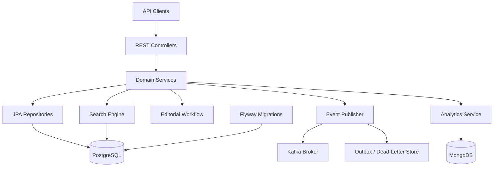
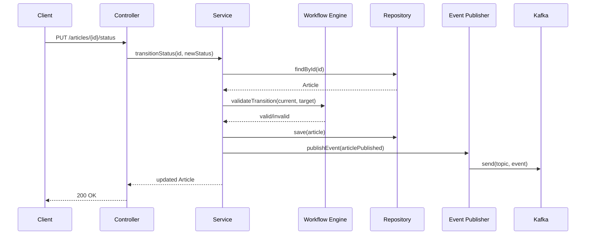
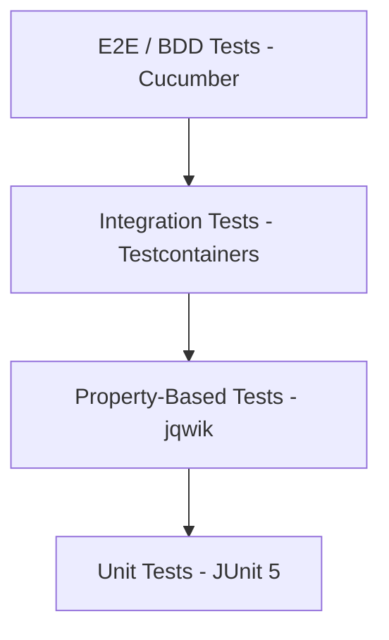

# Design Document: Content Publishing Platform

## Overview

The Content Publishing Platform is a Spring Boot 3.x microservice built with Java 21 and Kotlin that provides a complete content management and publishing workflow. The system manages authors, categories, and articles through an editorial lifecycle (draft → review → published), provides full-text search over published content, tracks engagement analytics, and emits domain events on publication for downstream consumers.

### Key Design Decisions

1. **Kotlin for domain logic, Java for infrastructure**: Kotlin's null safety, data classes, and sealed classes make it ideal for domain models and business logic. Java is used where Spring Boot integration is more idiomatic.
2. **Hexagonal Architecture (Ports & Adapters)**: Separates domain logic from infrastructure concerns, enabling testability and adherence to DIP.
3. **State Machine Pattern for Editorial Workflow**: Encapsulates transition rules in a dedicated component, making the workflow extensible without modifying article logic (OCP).
4. **CQRS-lite for Analytics**: Writes go to MongoDB asynchronously; reads aggregate on demand. This separates the high-write analytics path from the low-latency article API.
5. **Outbox Pattern for Kafka Events**: Ensures at-least-once delivery by writing events to a persistent store before publishing, avoiding distributed transaction issues.

## Architecture

### High-Level Architecture



### Package Structure

```
com.platform.content
├── api/                          # REST controllers, DTOs, exception handlers
│   ├── controller/
│   ├── dto/
│   └── error/
├── domain/                       # Domain entities, value objects, interfaces
│   ├── model/
│   ├── port/                     # Interfaces (ports) for outbound adapters
│   └── workflow/
├── application/                  # Application services (use cases)
│   ├── author/
│   ├── article/
│   ├── category/
│   ├── search/
│   └── analytics/
├── infrastructure/               # Adapters implementing domain ports
│   ├── persistence/              # JPA repositories, entity mappings
│   ├── search/                   # PostgreSQL tsvector implementation
│   ├── analytics/                # MongoDB repositories
│   ├── messaging/                # Kafka producer, outbox
│   └── config/                   # Spring configuration classes
└── ContentPublishingApplication.kt
```

### Layered Communication Flow



## Components and Interfaces

### REST API Layer

| Component | Responsibility |
|-----------|---------------|
| `AuthorController` | CRUD endpoints for Author entities |
| `CategoryController` | CRUD endpoints for Category entities |
| `ArticleController` | CRUD + list endpoints for Article entities |
| `ArticleWorkflowController` | Status transition endpoint |
| `SearchController` | Full-text search endpoint |
| `AnalyticsController` | Engagement metrics retrieval |
| `AnalyticsEventController` | Engagement event ingestion |
| `GlobalExceptionHandler` | RFC 7807 Problem Details error responses |

### Domain Ports (Interfaces)

```kotlin
// Port: Article persistence (ISP - focused on article operations only)
interface ArticleRepository {
    fun save(article: Article): Article
    fun findById(id: UUID): Article?
    fun findAll(filter: ArticleFilter, pageable: Pageable): Page<Article>
    fun deleteById(id: UUID)
    fun existsByAuthorId(authorId: UUID): Boolean
    fun existsByCategoryId(categoryId: UUID): Boolean
}

// Port: Full-text search (ISP - separate from general article persistence)
interface ArticleSearchPort {
    fun search(query: String, pageable: Pageable): Page<ArticleSearchResult>
}

// Port: Analytics write (ISP - write operations separated from read)
interface EngagementWritePort {
    fun recordPageView(articleId: UUID)
    fun recordReadTime(articleId: UUID, seconds: Int)
    fun recordInteraction(articleId: UUID, type: InteractionType)
}

// Port: Analytics read (ISP - read operations separated from write)
interface EngagementReadPort {
    fun getByArticleId(articleId: UUID): EngagementRecord
    fun getAggregatedByAuthorId(authorId: UUID): AggregatedEngagement
}

// Port: Event publishing (SRP - only responsible for publishing events)
interface ArticleEventPublisher {
    fun publishArticlePublished(event: ArticlePublishedEvent)
}
```

### Editorial Workflow Component

```kotlin
// Sealed class for type-safe state representation (Kotlin best practice)
sealed class ArticleStatus(val value: String) {
    data object Draft : ArticleStatus("draft")
    data object Review : ArticleStatus("review")
    data object Published : ArticleStatus("published")

    companion object {
        fun fromString(value: String): ArticleStatus = when (value.lowercase()) {
            "draft" -> Draft
            "review" -> Review
            "published" -> Published
            else -> throw IllegalArgumentException("Unknown status: $value")
        }
    }
}

// Strategy Pattern - validates transitions based on current state
interface WorkflowTransitionValidator {
    fun allowedTransitions(from: ArticleStatus): Set<ArticleStatus>
    fun validate(from: ArticleStatus, to: ArticleStatus): TransitionResult
}

sealed class TransitionResult {
    data object Valid : TransitionResult()
    data class Invalid(val currentState: ArticleStatus, val allowed: Set<ArticleStatus>) : TransitionResult()
}
```

### Event Publisher with Outbox Pattern

```kotlin
// Outbox store for reliable event delivery (DIP - abstraction)
interface OutboxStore {
    fun save(event: OutboxEvent): OutboxEvent
    fun findPending(): List<OutboxEvent>
    fun markDelivered(id: UUID)
    fun markFailed(id: UUID, reason: String)
}

data class OutboxEvent(
    val id: UUID,
    val aggregateType: String,
    val aggregateId: UUID,
    val eventType: String,
    val payload: String,
    val status: OutboxEventStatus,
    val retryCount: Int,
    val createdAt: Instant,
    val lastAttemptedAt: Instant?
)

enum class OutboxEventStatus { PENDING, DELIVERED, FAILED }
```

## Data Models

### PostgreSQL Schema

#### Authors Table

| Column | Type | Constraints |
|--------|------|-------------|
| id | UUID | PRIMARY KEY, DEFAULT gen_random_uuid() |
| name | VARCHAR(100) | NOT NULL |
| email | VARCHAR(255) | NOT NULL, UNIQUE |
| bio | VARCHAR(500) | NULLABLE |
| created_at | TIMESTAMP WITH TIME ZONE | NOT NULL, DEFAULT NOW() |

#### Categories Table

| Column | Type | Constraints |
|--------|------|-------------|
| id | UUID | PRIMARY KEY, DEFAULT gen_random_uuid() |
| name | VARCHAR(100) | NOT NULL, UNIQUE (case-insensitive via citext or unique index on lower(name)) |
| description | VARCHAR(500) | NULLABLE |
| slug | VARCHAR(120) | NOT NULL, UNIQUE |

#### Articles Table

| Column | Type | Constraints |
|--------|------|-------------|
| id | UUID | PRIMARY KEY, DEFAULT gen_random_uuid() |
| title | VARCHAR(255) | NOT NULL |
| body | TEXT | NOT NULL |
| summary | VARCHAR(500) | NULLABLE |
| author_id | UUID | NOT NULL, FK → authors(id) |
| category_id | UUID | NOT NULL, FK → categories(id) |
| tags | TEXT[] | NOT NULL, DEFAULT '{}' |
| status | VARCHAR(20) | NOT NULL, DEFAULT 'draft', CHECK IN ('draft','review','published') |
| created_at | TIMESTAMP WITH TIME ZONE | NOT NULL, DEFAULT NOW() |
| updated_at | TIMESTAMP WITH TIME ZONE | NOT NULL, DEFAULT NOW() |
| published_at | TIMESTAMP WITH TIME ZONE | NULLABLE |
| search_vector | tsvector | Generated from title and body |

**Indexes:**
- `idx_articles_author_id` on `author_id`
- `idx_articles_category_id` on `category_id`
- `idx_articles_status` on `status`
- `idx_articles_tags` GIN index on `tags`
- `idx_articles_search_vector` GIN index on `search_vector`

**Trigger:** Auto-update `search_vector` on INSERT/UPDATE of title or body using `to_tsvector('english', coalesce(title,'') || ' ' || coalesce(body,''))`.

#### Outbox Events Table

| Column | Type | Constraints |
|--------|------|-------------|
| id | UUID | PRIMARY KEY |
| aggregate_type | VARCHAR(50) | NOT NULL |
| aggregate_id | UUID | NOT NULL |
| event_type | VARCHAR(50) | NOT NULL |
| payload | JSONB | NOT NULL |
| status | VARCHAR(20) | NOT NULL, DEFAULT 'pending' |
| retry_count | INT | NOT NULL, DEFAULT 0 |
| created_at | TIMESTAMP WITH TIME ZONE | NOT NULL |
| last_attempted_at | TIMESTAMP WITH TIME ZONE | NULLABLE |

#### Flyway Migration Naming

```
V1__create_authors_table.sql
V2__create_categories_table.sql
V3__create_articles_table.sql
V4__create_search_vector_trigger.sql
V5__create_outbox_events_table.sql
```

### MongoDB Schema

#### Engagement Record Document

```json
{
  "_id": "ObjectId",
  "articleId": "UUID string",
  "pageViews": 0,
  "totalReadTimeSeconds": 0,
  "readTimeCount": 0,
  "averageReadTimeSeconds": 0.0,
  "interactions": {
    "likes": 0,
    "shares": 0,
    "comments": 0
  },
  "lastUpdated": "ISODate"
}
```

**Indexes:**
- Unique index on `articleId`
- Index on `lastUpdated` for housekeeping queries

### Domain Entity Models (Kotlin)

```kotlin
data class Author(
    val id: UUID,
    val name: String,
    val email: String,
    val bio: String?,
    val createdAt: Instant
)

data class Category(
    val id: UUID,
    val name: String,
    val description: String?,
    val slug: String
)

data class Article(
    val id: UUID,
    val title: String,
    val body: String,
    val summary: String?,
    val authorId: UUID,
    val categoryId: UUID,
    val tags: List<String>,
    val status: ArticleStatus,
    val createdAt: Instant,
    val updatedAt: Instant,
    val publishedAt: Instant?
)

data class EngagementRecord(
    val articleId: UUID,
    val pageViews: Long,
    val averageReadTimeSeconds: Double,
    val interactions: InteractionCounts
)

data class InteractionCounts(
    val likes: Long,
    val shares: Long,
    val comments: Long
)

data class ArticlePublishedEvent(
    val articleId: UUID,
    val title: String,
    val authorId: UUID,
    val category: String,
    val tags: List<String>,
    val publishedAt: Instant
)
```

### API DTOs

```kotlin
// Request DTOs (using Bean Validation annotations)
data class CreateAuthorRequest(
    @field:NotBlank @field:Size(min = 1, max = 100) val name: String,
    @field:NotBlank @field:Email @field:Size(max = 255) val email: String,
    @field:Size(max = 500) val bio: String?
)

data class CreateArticleRequest(
    @field:NotBlank @field:Size(max = 255) val title: String,
    @field:NotBlank val body: String,
    @field:Size(max = 500) val summary: String?,
    val authorId: UUID,
    val categoryId: UUID,
    @field:Size(max = 10) val tags: List<String> = emptyList()
)

data class TransitionStatusRequest(
    @field:NotBlank val targetStatus: String
)

// Response DTOs
data class ArticleResponse(
    val id: UUID,
    val title: String,
    val body: String,
    val summary: String?,
    val authorId: UUID,
    val categoryId: UUID,
    val tags: List<String>,
    val status: String,
    val createdAt: String,
    val updatedAt: String,
    val publishedAt: String?
)

// Pagination wrapper (matches requirement 10.4)
data class PageResponse<T>(
    val content: List<T>,
    val page: Int,
    val size: Int,
    val totalElements: Long,
    val totalPages: Int
)

// RFC 7807 Problem Details (requirement 10.2)
data class ProblemDetail(
    val type: String,
    val title: String,
    val status: Int,
    val detail: String,
    val instance: String,
    val fieldErrors: List<FieldError>? = null
)

data class FieldError(
    val field: String,
    val message: String
)
```

## Correctness Properties

*A property is a characteristic or behavior that should hold true across all valid executions of a system — essentially, a formal statement about what the system should do. Properties serve as the bridge between human-readable specifications and machine-verifiable correctness guarantees.*

### Property 1: Author field validation

*For any* string inputs for name, email, and bio: the author validation logic should accept inputs where name is 1–100 characters and non-blank, email conforms to RFC 5322 format and is ≤ 255 characters, and bio (if provided) is ≤ 500 characters — and reject all inputs violating any of these constraints.

**Validates: Requirements 1.2, 1.5**

### Property 2: Author deletion guard

*For any* author who has one or more articles in any status (draft, review, or published), attempting to delete that author should always be rejected with an error indicating associated articles exist.

**Validates: Requirements 1.3**

### Property 3: Duplicate email uniqueness

*For any* two authors, if the second author is created or updated with an email address that already belongs to another author, the operation should always be rejected with a duplicate email error.

**Validates: Requirements 1.6**

### Property 4: Category name validation

*For any* string input for category name: the validation logic should accept names that are 2–100 characters, non-blank, and unique (case-insensitive) — and reject names that are blank, shorter than 2 characters, longer than 100 characters, or duplicate an existing name under case-insensitive comparison.

**Validates: Requirements 2.2**

### Property 5: Slug generation invariants

*For any* valid category name, the auto-generated slug should be: entirely lowercase, contain only characters matching `[a-z0-9-]`, be non-empty, and be deterministic (the same name always produces the same slug).

**Validates: Requirements 2.5**

### Property 6: Category deletion guard

*For any* category that has one or more articles assigned to it, attempting to delete that category should always be rejected with an error indicating the category is in use.

**Validates: Requirements 2.3**

### Property 7: New article default status

*For any* valid article creation request (with valid title, body, author_id, and category_id), the resulting article entity should always have status "draft" and a null published_at timestamp.

**Validates: Requirements 3.2**

### Property 8: Article field validation

*For any* article creation or update input: the validation logic should accept inputs where title is 1–255 characters and non-blank, body is non-blank, summary (if provided) is ≤ 500 characters, and tags contains ≤ 10 entries — and reject all inputs violating any of these constraints.

**Validates: Requirements 3.8**

### Property 9: Published article deletion guard

*For any* article in "published" status, attempting to delete that article should always be rejected with an error indicating published articles cannot be deleted.

**Validates: Requirements 3.10**

### Property 10: Editorial workflow state machine

*For any* article status and any target status, the transition validator should: allow only "review" from "draft", allow only "published" or "draft" from "review", allow no transitions from "published" — and for any rejected transition, the error should include the current state and the set of allowed transitions.

**Validates: Requirements 4.2, 4.3, 4.4, 4.5**

### Property 11: Transition timestamp updates

*For any* successful status transition, the article's updated_at timestamp should be set to approximately the current UTC time. Additionally, when the transition target is "published", the published_at timestamp should also be set to approximately the current UTC time.

**Validates: Requirements 4.6, 4.7**

### Property 12: Pagination invariants

*For any* list or search request with pagination parameters: page size values between 1 and 100 should be accepted, values outside this range should be rejected or clamped, the default page size should be 20, and the response metadata (page, size, totalElements, totalPages) should be internally consistent such that `totalPages = ceil(totalElements / size)`.

**Validates: Requirements 3.4, 5.3, 10.4**

### Property 13: Article list filtering correctness

*For any* dataset of articles and any combination of filters (author, category, status, tags), all articles returned in the result set must satisfy every specified filter criterion.

**Validates: Requirements 3.5**

### Property 14: Search returns only published articles

*For any* full-text search query executed against a dataset containing articles in mixed statuses (draft, review, published), every article in the result set must have status "published".

**Validates: Requirements 5.4**

### Property 15: Blank search query rejection

*For any* string that is empty or composed entirely of whitespace characters, submitting it as a search query should be rejected with an error indicating a non-empty search term is required.

**Validates: Requirements 5.6**

### Property 16: Read time average computation

*For any* sequence of valid read time values (integers between 1 and 3600 inclusive) recorded for a single article, the stored average read time should equal the arithmetic mean of all recorded values. For any read time value less than 1 or greater than 3600, the event should be discarded without modifying the stored average.

**Validates: Requirements 6.3, 6.7**

### Property 17: Interaction count increment

*For any* sequence of interaction events (like, share, or comment) for a single article, the final count for each interaction type should equal the total number of events of that type in the sequence.

**Validates: Requirements 6.4**

### Property 18: Author analytics aggregation

*For any* set of engagement records across an author's articles, the aggregated metrics should satisfy: total page views equals the sum of individual article page views, total interactions equals the sum of individual interaction counts, and the overall average read time equals the weighted average (weighted by page views per article).

**Validates: Requirements 7.2**

### Property 19: Event payload completeness

*For any* article that transitions to "published" status, the emitted Kafka event payload should contain all required fields: article id, title, author id, category, tags, and published_at timestamp — with none being null or missing.

**Validates: Requirements 8.2**

### Property 20: Article serialization round-trip

*For any* valid Article entity (with any combination of non-null and null fields, any valid tags list including empty, and any valid date-time values), serializing to JSON and deserializing back should produce a field-by-field equivalent object where: text fields match by string equality, tags match by element-order equality, date-time fields match by millisecond-precision equality, null fields appear as JSON null (not omitted), empty tags appear as an empty JSON array (not null), and all date-time fields use ISO 8601 format with pattern `yyyy-MM-dd'T'HH:mm:ss.SSS'Z'`.

**Validates: Requirements 12.1, 12.2, 12.3, 12.4, 12.5**

## Error Handling

### Exception Hierarchy

```kotlin
// Base domain exception (SRP - each subtype represents one error condition)
sealed class DomainException(message: String) : RuntimeException(message)

// Entity not found
data class EntityNotFoundException(
    val entityType: String,
    val entityId: UUID
) : DomainException("$entityType with id $entityId not found")

// Conflict (duplicate, in-use)
data class ConflictException(
    val entityType: String,
    val conflictReason: String
) : DomainException("$entityType conflict: $conflictReason")

// Invalid state transition
data class InvalidTransitionException(
    val currentState: ArticleStatus,
    val targetState: ArticleStatus,
    val allowedTransitions: Set<ArticleStatus>
) : DomainException(
    "Cannot transition from ${currentState.value} to ${targetState.value}. " +
    "Allowed: ${allowedTransitions.map { it.value }}"
)

// Validation error (when Bean Validation is insufficient)
data class ValidationException(
    val fieldErrors: List<FieldError>
) : DomainException("Validation failed: ${fieldErrors.joinToString { "${it.field}: ${it.message}" }}")

// Event publishing failure
data class EventPublishingException(
    val eventId: UUID,
    val reason: String
) : DomainException("Failed to publish event $eventId: $reason")
```

### Global Exception Handler

```kotlin
@RestControllerAdvice
class GlobalExceptionHandler {

    // Maps domain exceptions to RFC 7807 Problem Details responses
    @ExceptionHandler(EntityNotFoundException::class)
    fun handleNotFound(ex: EntityNotFoundException, request: HttpServletRequest): ResponseEntity<ProblemDetail>
    // → HTTP 404

    @ExceptionHandler(ConflictException::class)
    fun handleConflict(ex: ConflictException, request: HttpServletRequest): ResponseEntity<ProblemDetail>
    // → HTTP 409

    @ExceptionHandler(InvalidTransitionException::class)
    fun handleInvalidTransition(ex: InvalidTransitionException, request: HttpServletRequest): ResponseEntity<ProblemDetail>
    // → HTTP 422

    @ExceptionHandler(MethodArgumentNotValidException::class)
    fun handleValidation(ex: MethodArgumentNotValidException, request: HttpServletRequest): ResponseEntity<ProblemDetail>
    // → HTTP 422 with field-level errors

    @ExceptionHandler(ValidationException::class)
    fun handleDomainValidation(ex: ValidationException, request: HttpServletRequest): ResponseEntity<ProblemDetail>
    // → HTTP 422 with field-level errors
}
```

### Error Response Mapping

| Exception Type | HTTP Status | Problem Details Type |
|---------------|-------------|---------------------|
| `EntityNotFoundException` | 404 | `/problems/not-found` |
| `ConflictException` | 409 | `/problems/conflict` |
| `InvalidTransitionException` | 422 | `/problems/invalid-transition` |
| `MethodArgumentNotValidException` | 422 | `/problems/validation-error` |
| `ValidationException` | 422 | `/problems/validation-error` |
| Unexpected exceptions | 500 | `/problems/internal-error` |

### Retry Strategy for Event Publishing

```
Attempt 1: Immediate send to Kafka
Attempt 2: Wait 1 second, retry
Attempt 3: Wait 2 seconds, retry
Attempt 4: Wait 4 seconds, retry (final)
On failure: Write to outbox/dead-letter store, log at ERROR level
```

The outbox processor runs on a scheduled basis (every 30 seconds) to retry pending events that haven't exceeded the maximum retry count.

## Testing Strategy

### Test Pyramid



### Unit Tests (JUnit 5 + MockK)

Focus areas:
- Domain model validation logic (Author, Category, Article field validation)
- Editorial workflow state machine transitions
- Slug generation function
- Analytics computation (running average, aggregation)
- Event payload construction
- Error mapping in GlobalExceptionHandler

### Property-Based Tests (jqwik)

The project uses [jqwik](https://jqwik.net/) as the property-based testing library for JUnit 5 integration.

**Configuration:**
- Minimum 100 iterations per property test (`@Property(tries = 100)`)
- Each test references its design property via tag annotation
- Tag format: `@Tag("Feature: content-publishing-platform, Property {N}: {title}")`

**Properties to implement:**
1. Author field validation (Property 1)
2. Duplicate email uniqueness (Property 3)
3. Category name validation (Property 4)
4. Slug generation invariants (Property 5)
5. New article default status (Property 7)
6. Article field validation (Property 8)
7. Editorial workflow state machine (Property 10)
8. Transition timestamp updates (Property 11)
9. Pagination invariants (Property 12)
10. Article list filtering correctness (Property 13)
11. Search returns only published articles (Property 14)
12. Blank search query rejection (Property 15)
13. Read time average computation (Property 16)
14. Interaction count increment (Property 17)
15. Author analytics aggregation (Property 18)
16. Event payload completeness (Property 19)
17. Article serialization round-trip (Property 20)

### Integration Tests (JUnit 5 + Testcontainers)

Focus areas:
- PostgreSQL: CRUD operations, FK constraints, tsvector search, Flyway migrations
- MongoDB: Engagement record upsert, aggregation queries
- Kafka: Event publishing, retry behavior, dead-letter store
- Full API request/response cycle with real databases
- Health check and startup behavior

### BDD Tests (Cucumber)

Feature files covering key user journeys:
- Author creates article → submits for review → editor publishes → event emitted
- Reader searches for articles → finds published content
- Analytics recording and retrieval flow
- Error scenarios (invalid transitions, duplicate emails, deletion guards)

### Test Environment

All integration and BDD tests use Testcontainers for:
- PostgreSQL 16
- MongoDB 7
- Kafka (using `confluentinc/cp-kafka` or Redpanda)

This ensures tests run against real database engines without requiring external infrastructure.
